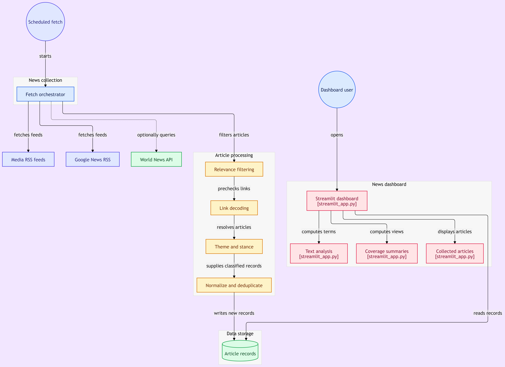

# Pax Silica Media Monitor (NLP)

A transparent, rule-based news monitor that tracks how Philippine media covers **Pax Silica**, the U.S.-led initiative on technology, AI and critical-mineral supply chains in which the Philippines is a participant.

**Live dashboard:** https://newsmonitoringnlp.streamlit.app/

---

## Table of Contents

1. [Overview](#overview)
2. [Research Questions](#research-questions)
3. [Key Features](#key-features)
4. [System Architecture](#system-architecture)
5. [Data Sources](#data-sources)
6. [Methodology](#methodology)
7. [Tech Stack](#tech-stack)
8. [Repository Structure](#repository-structure)
9. [Setup and Configuration](#setup-and-configuration)
10. [Limitations](#limitations)
11. [Roadmap](#roadmap)
12. [Author](#author)
13. [Acknowledgements and References](#acknowledgements-and-references)

---

## Overview

This tool is designed for **journalists and researchers who do not have access to commercial media intelligence platforms**. It is a topic-specific monitor built to answer defined research questions about a single policy debate. Its taxonomy is designed for Philippine policy coverage, and its method can be **audited end to end**: every label can be traced back to the keywords that triggered it.

Unlike general-purpose sentiment tools, which tend to read policy language poorly, the monitor uses domain-specific keyword dictionaries and custom stance word lists, so results reflect how the Pax Silica debate is actually framed in Philippine media.

## Research Questions

> *Replace or edit these to match your capstone proposal.*

1. Which themes dominate Philippine coverage of Pax Silica, and how does this change over time?
2. Is coverage predominantly supportive, critical or neutral toward the initiative?
3. How do stance and themes vary across news outlets?

## Key Features

- **Automated daily collection** of Pax Silica coverage from news APIs and Philippine RSS feeds
- **Multi-label theme tagging** across seven themes (an article can belong to more than one)
- **Transparent stance scoring** (Supportive, Critical or Neutral) based on custom word lists
- **Deduplication** and Google News link decoding for clean, unique records
- **Interactive dashboard** built with Streamlit and Plotly, refreshed from a live data store
- **Fully auditable logic**: no black-box model, and keyword lists are plain, reviewable text

## System Architecture

> **[Insert your GitHub architecture diagram here]**
>
> ```markdown
> 
> ```

The pipeline runs on a schedule and feeds a live dashboard:

1. **GitHub Actions** triggers `fetch_and_append.py` daily.
2. The script pulls articles from the World News API and Philippine RSS feeds.
3. Articles are filtered, cleaned, deduplicated, and classified by theme and stance.
4. New rows are appended to a **Google Sheet**, which serves as the data store.
5. **Streamlit** (`streamlit_app.py`) reads the sheet and renders the dashboard.

## Data Sources

| Source | Type | Notes |
|---|---|---|
| World News API | News API | `search-news` endpoint, restricted to Philippine sources; operates within a free-tier daily point budget |
| GMA News, Philippine Daily Inquirer, Manila Bulletin, Philippine Star, Rappler | RSS | National outlets |
| BusinessWorld Online, Journal, Manila Times, Philippine News Agency, Abante | RSS | Business, state and additional national coverage |

Only the **headline and summary** of each article are analyzed. Full article text is not stored or processed.

## Methodology

### Rule-based approach

The monitor uses a **rule-based NLP approach**: predefined dictionaries and explicit rules are applied to text, rather than a trained statistical model. This makes every classification deterministic, reproducible and explainable.

> **[Insert the "Rule-Based Approach in NLP" flowchart here]**
>
> ```markdown
> 
> *Source: GeeksforGeeks, "Rule-Based Approach in NLP"
> (https://www.geeksforgeeks.org/nlp/rule-based-approach-in-nlp/)*
> ```
>
> Check the site's reuse terms before including the image. If reuse is not permitted, link to the page instead or redraw the flowchart in your own words and layout, still crediting the source.

### Processing pipeline

For each article's headline and summary, the pipeline runs these steps in order:

1. **Relevance filtering:** keep only articles that mention "Pax Silica" by name.
2. **Text cleaning:** remove noise and lowercase the text.
3. **Link decoding:** resolve Google News redirect links to the original article URL.
4. **Deduplication:** remove duplicate articles before storage.
5. **Theme matching:** compare the text against seven keyword dictionaries.
6. **Stance scoring:** count supportive versus critical terms.
7. **Storage:** append the labeled record to the Google Sheet.

### Theme classification

Each article is checked against keyword dictionaries for seven themes. An article can match **more than one** theme.

| Theme | Scope |
|---|---|
| Economic Development | Investment, trade, growth, industrial development |
| Technological Advancement | Semiconductors, AI, digital infrastructure |
| Human Capital & Employment | Jobs, skills, workforce development |
| Supply-Chain Resilience | Critical minerals, supply-chain security, processing |
| Environmental & Resource Impact | Mining, ecological and community impacts |
| Institutional Governance | Agreements, regulation, policy and oversight |
| Geopolitical Security | Alliances, regional security, U.S.-China dynamics |

The dictionaries combine **official and policy terms** (for example, "bilateral agreement") with **civil-society terms** (for example, "moratorium"), so both government and critic framings are captured.

### Stance classification

Stance is scored using custom **supportive** and **critical** word lists:

- More supportive terms than critical terms → **Supportive**
- More critical terms than supportive terms → **Critical**
- A tie, or no clear signal → **Neutral**

Labels come from the keyword classifier applied to each article's headline and summary.

### Validation and refinement

The classification rules were developed iteratively. Outputs were reviewed manually, misclassifications were corrected, and the keyword lists were refined until errors became less frequent. Lists are reviewed periodically because the vocabulary around Pax Silica changes quickly.

> *If you recorded a manual check (for example, "reviewed N articles, X% agreement"), add it here. A single accuracy figure strengthens the credibility of the method.*

### Why not a generic sentiment library?

General-purpose polarity scoring (such as TextBlob) was tested and removed. It does not capture stance in political and policy coverage, where "investment" or "security" can be positive or negative depending on who is speaking. Domain-specific word lists give more relevant and explainable results.

## Tech Stack

| Component | Tool |
|---|---|
| Pipeline | Python |
| Data wrangling | pandas |
| Scheduling / CI | GitHub Actions |
| Data store | Google Sheets (via Google service account) |
| Dashboard | Streamlit, Plotly |
| Hosting | Streamlit Community Cloud |

## Repository Structure

```text
.
├── fetch_and_append.py    # Daily pipeline: fetch, filter, classify, append
├── streamlit_app.py       # Dashboard application
├── requirements.txt       # Python dependencies
└── .github/workflows/     # Scheduled GitHub Actions workflow
```

## Setup and Configuration

### Prerequisites

- Python 3.9 or later
- A World News API key
- A Google Cloud service account with the Google Sheets and Drive APIs enabled
- A Google Sheet shared with the service account

### Repository secrets

| Secret | Purpose |
|---|---|
| `NEWS_API_KEY` | World News API key |
| `GOOGLE_SHEET_ID` | ID of the Google Sheet used as the data store |
| `GOOGLE_SERVICE_ACCOUNT_JSON` | Service account credentials |

Never commit credentials to the repository.

### Run locally

```bash
pip install -r requirements.txt
python fetch_and_append.py      # collect and classify articles
streamlit run streamlit_app.py  # launch the dashboard
```

## Limitations

- **Keyword matching is literal.** It cannot detect sarcasm, negation, or implied meaning.
- **Headline and summary only.** Stance in the full article body may differ.
- **Dictionaries need upkeep.** New terminology can be missed until the lists are updated.
- **Stance is not a measure of public opinion.** It describes media framing only.

## Roadmap

- Add sentence or document embeddings and clustering to surface narratives the keyword lists do not anticipate
- Report validation metrics against a manually labeled sample
- Expand outlet coverage and keyword lists, including Filipino-language terms
- Add alerts or exports for researchers

## Author

**[Your Name]**
Development professional with experience in research, technical reporting, and monitoring and evaluation, building skills in data analysis.
[Portfolio](#) · [LinkedIn](#) · [GitHub](#)

## Acknowledgements and References

- Rule-based NLP flowchart: GeeksforGeeks, ["Rule-Based Approach in NLP"](https://www.geeksforgeeks.org/nlp/rule-based-approach-in-nlp/)
- News data: World News API and the RSS feeds of the outlets listed above
- Built as a capstone project for the Eskwelabs Data Analytics Bootcamp
